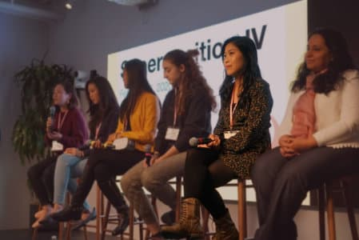
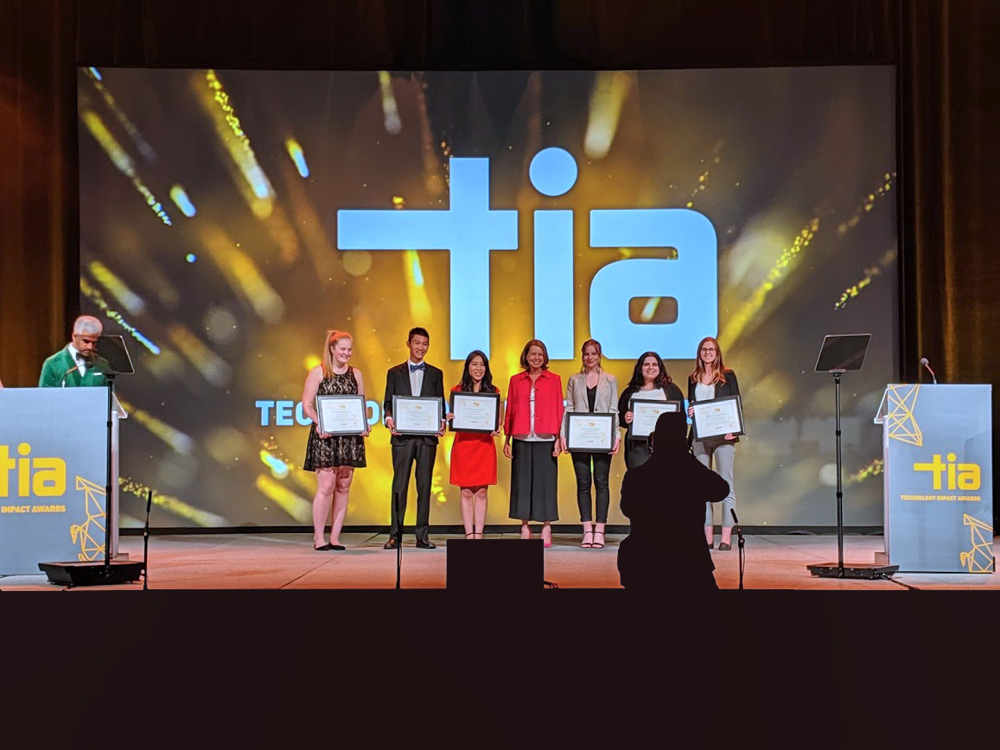

Hello there! My name is Daphne.

- Email: [daphne.liu97@gmail.com](mailto:daphne.liu97@gmail.com)
- Resume: [PDF](resume.pdf)
- Github: [github.com/daphliu](https://github.com/daphliu)
- Linkedin: [linkedin.com/in/daphliu/](https://www.linkedin.com/in/daphliu/)

### Education

**University of British Columbia**,  
Bachelor of Science in Computer Science,  
4th Year _(Sep 2015 - May 2021)_

### Industry

  
  

    <h5>Lyft, Software Developer Intern <em>June 2020 – July 2020</em></h5>
    <ul>
      <li>Will be working on front-end for Lyft’s Progressive Web App for riders in React, Redux, NextJS, TypeScript.</li>
    </ul>
  

  
  

    <h5>Yelp, Android Developer Intern <em>Jan 2019 – Apr 2019</em></h5>
    <ul>
      <li>Took ownership of implementation and launch for app-wide feature in the Yelp for Business Owner app.</li>
      <li>Using Kotlin, Koin, RxJava, built carousels with nested scrolling content to promote major business features.</li>
      <li>Planned and implemented architecture migration from MVP to MVI for Android alert banner with JUnit tests.</li>
    </ul>
  

  
  

    <h5>Shopify, Android Developer Intern <em>May 2019 – Aug 2019</em></h5>
    <ul>
      <li>Planned and implemented the WebView remote debugging feature on Shopify’s Android app.</li>
      <li>Developed a notification system on Android with Java, Kotlin, and GraphQL to alert merchants of plugin issues.</li>
      <li>Wrote advanced HTML to Android Spannable parser in Kotlin to render nested bulleted list data.</li>
    </ul>
  

  
  

    <h5>Hootsuite, Software Developer Intern <em>Jan 2019 – Apr 2019</em></h5>
    <ul>
      <li>Added dynamic loading, category assignment, instant search to app store admin page with React, HTML/CSS.</li>
      <li>Worked with cross-functional teams to launch Hootsuite app store and implemented API endpoints in Scala.</li>
    </ul>
  

  
  

    <h5>Royal Bank of Canada, Software Developer Intern <em>May 2018 – Aug 2018</em></h5>
    <ul>
      <li>Increased efficiency of commodity tax data lookups by 2 months per year with C# and .NET automation.</li>
      <li>Investigated, improved a 13-year-old system and served as single point of contact for business and QA teams.</li>
    </ul>
  

  
  

    <h5>Google, Google CodeU Mentorship program <em>Feb 2018 – May 2018</em></h5>
    <ul>
      <li>Selected to participate in Google CodeU, an invite-only program to be mentored by a Google engineer.</li>
      <li>Built a chat app in Java and introduced offline support by caching HTML pages and CSS with JavaScript.</li>
    </ul>
  

### Projects

##### Founder and Co-president, UBC Women in CS _Sept 2019 - Apr 2020_

- Started [UBC Women in CS club](http://ubcwics.com/), assembling a team of 10 student executives and 3 departmental sponsors, defining the mission and establishing overall infrastructure.
- Represented the club in monthly department meetings to discuss progress and changes to the Computer Science department.
- Executed 4 events throughout the term, such as paint night and board game events, reaching over 90 female CS students at UBC.

##### Co-Founder, UBC CS Coffee Chat _Sept 2019 - Apr 2020_

- Matched 150+ lower year to upper year Computer Science students at UBC for monthly coffee chats, providing a chance to ask questions and receive mentorship.
- Wrote a Python script to consume CSV data from Qualtrics forms and generate matching based on preferences.

##### Team Lead and AR Developer, UBC Emerging Media Lab _Jan 2018 – Apr 2019_

- Liaised between 7 developers and a professor to build [Soil TopARgraphy](https://eml.ubc.ca/projects/soil-topargraphy/), an Augmented Reality app for a soil science class, built using Unity, Vuforia, and C#.
- Project presented at 3 conferences, released on app stores, and is ready to be used by 250+ students.

##### Color Breakdown, Personal Project _Oct 2018 – May 2020_

- Wrote Progressive Web App with Typescript and React to extract prominent colors from images.
- Ported functionality to separate native Android app in Kotlin and published on [Google Play](https://play.google.com/store/apps/details?id=com.tigerxdaphne.colorbreakdown&hl=en_CA).

### Speaking

  

- **Panelist, Superposition IV** - Superposition IV is the largest 24-hour hackathon for high school and college women in the Bay Area, hosted at the Uber office. I spoke on a panel to 220+ students answering questions about my experiences and and sharing advice to inspire the next generation of women in tech.
- **Workshop Speaker, Hack the 6ix** - Hack the 6ix is Toronto’s largest summer hackathon. I planned and taught an [1-hour workshop](https://docs.google.com/presentation/d/13ctfuE2er8tIpMJBbsziaO-C1yIYmb5Gcf_QJ8IdyBA/edit?usp=sharing) to 50+ students on making an Android app using Kotlin, Coroutines, Retrofit. I demonstrated how to make a simple UI and make network calls to Google Maps API through live-coding.
- **Conference Panelist, Microsoft Higher Education Summit** - The Microsoft Higher Education Summit is a discussion on adapting curriculum, re-skilling and internships to the growing needs of tech. I was selected by Hootsuite to speak on a panel to 150+ attendees on the changes I'm hoping to see in classes and internships. I shared my views about imposter syndrome and people [tweeted](https://twitter.com/Kristin__Wilkes/status/1105197977830809600) about it!

### Awards

  
  

- **BC Tech Scholarship 2019** - Awarded to students who have a proven passion for technology and a desire to leave a mark in the tech sector. I was featured in a [press release](https://www.newswire.ca/news-releases/technology-impact-awards-celebrate-new-levels-of-growth-competitiveness-808333802.html), [magazine](https://biv.com/magazine/bc-tech-2019) and was invited to meet Prime Minister Justin Trudeau.
- **IKB Women in Technology Scholarship 2019** - Awarded on the basis of academic achievement. [Tweeted](https://twitter.com/ubcprez/status/1202006272868069378) by UBC president Santa Ono.
- **VISIER Service Award for Women in Computer Science 2019** - Awarded for community service and student leadership.
- **UBC Grace Hopper Conference Scholarship 2018** - Attended the world's largest gathering of women in computing.
- **Hackathon Winner, Lumohacks 2017** - Built VR scenarios to help patients tackle phobias, built with Unity and C#.

### Blogs
- **"Making Nested Lists with Android Spannables in Kotlin"** - This blog post received 2,000+ views and was published by The Startup, Medium's largest active publication followed by 631K+ people. The blog is a tutorial on how to make nested lists with Android Spannables, which I learned during my Shopify internship. I created a lean sample Android application to walk through a step-by-step approach to developers.
- **"Advice from Full-timers at Hootsuite to Co-ops"** - During my Hootsuite internship, I interviewed the CEO, Vice President, Director, manager, and software engineers through coffee chats to share their advice to interns from their views and experiences.
